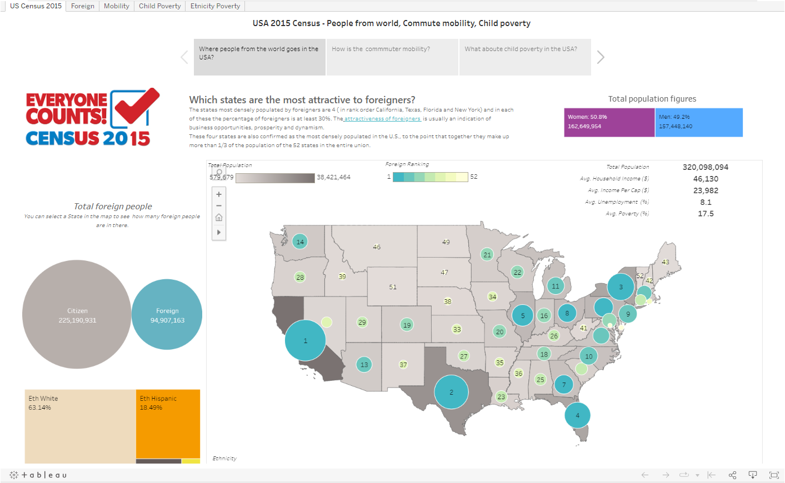
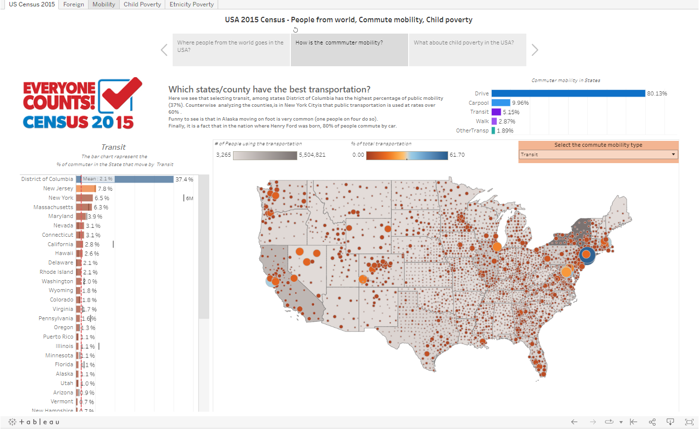
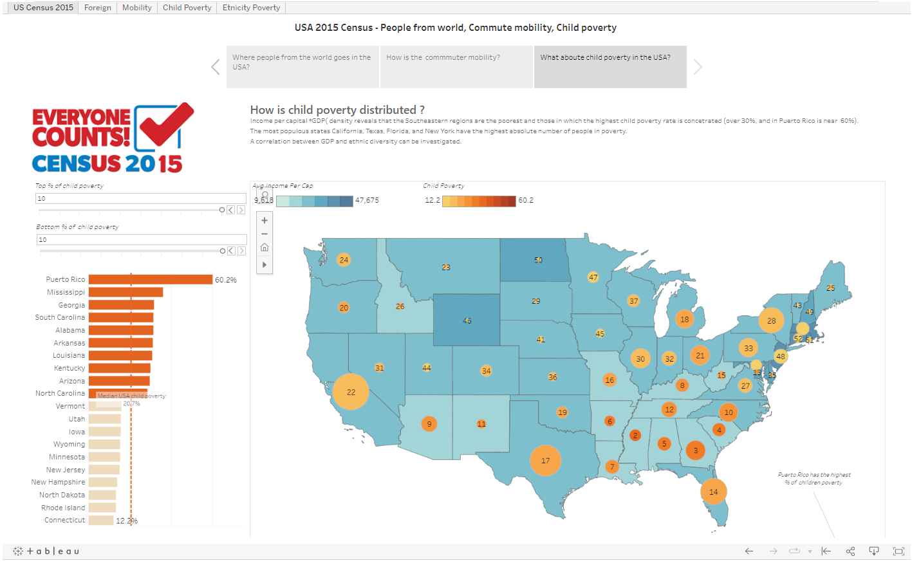
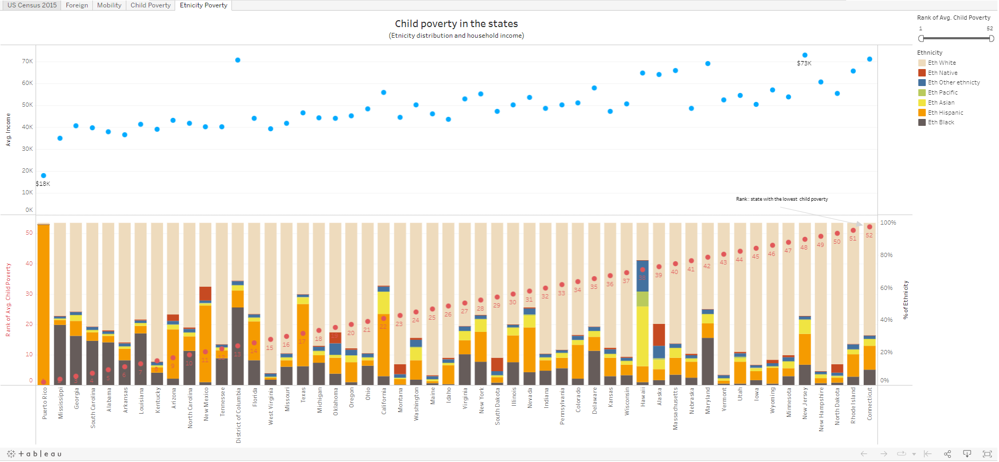



# VISUAL ANALYSIS WITH TABLEAU

Insight from 2015 USA Census Data (data source at [this link](https://www.kaggle.com/datasets/muonneutrino/us-census-demographic-data)) 

The analyses is posted at[ this link,](https://public.tableau.com/app/profile/alx4976/viz/Census_16655268075390/USCensus2015?publish=yes) and it is divided in 3 panels. 

Panel 1: Which states are the most attractive to foreigners in the U.S.A.? 

Summary: 

The states most densely populated by foreigners are 4 ( in rank order California, Texas, Florida and New York) and in each of these the percentage of foreigners is at least 30%. The attractiveness of foreigners can be taken as an indicator of business opportunities, prosperity and dynamism. 

These four states are also confirmed as the most densely populated in the U.S. and together count more than 1/3 of the population of the 52 states in the entire union.  

Design: 

The shades of gray in the map show the distribution of population across the states. The circles represent the population of foreigners:  

- size represents the percentage of foreigners to the population  
- color the ranking of percentage 
- tooltip give the detail of the percentual 

In the upper right are economic data on population and in the bottom left the ethnicity and number of foreign. These figures change upon selection on the map.     

Panel 2: How is the public transportation system for commuters? 

Analysis of commuter mobility reveals that:  

- In all states the most commonly used transportation is the car, as that is used by commuters with a range from about 70% to 85%. 
- This is followed by carpooling, with an average of 10%. 
- about 4% of the population goes on foot 
- Public transportation is not widely used, by an average of 2 percent  
- 1.9% of the commuters uses other mobility. 

Looking in detail at public transportation - if we look at the percentage of commuters that use public transportation as an indicator of the quality of public transportation -  the state that have well over 34% of commuters on transit is the Columbia district. Moving down the rankings we have New Jersey (7.8%), New York (6.5%) , Massachuttes (6.3%) and Maryland (3.9%); all states concentrated in the northeastern area. Not surprisingly, New York's county reach peaks of 60% use of public transportation, given that county's famous city layout. 

In contrast, it is funny to see commuters mobility in Alaska.  Alaska has 23.9% of commuters who commute by foot (the USA average is 2 percent) and that 10 % of commuters commute by "other transportation" (the national average is 1.9 percent). 

Design: 

It is possible to select the type of transportation used by commuters (the commuter mobility). 

The shades of gray in the map show the number of commuters using the transportation type across the county. Size and color of circles represent the percentage of the commuter using that type of transportation **in the county**.  

On the left and on the top there the view is **for states**. The left bar chart is the filter for the top pane and the map.  

Tooltip gives details of the percentual. 

Pannello 3 : What is the poverty status of children in the states? 

Mapping USA per capita income reveals that the southeastern part of the nation is the regions with the lowest per capita income and that in those areas the top 10 states with the highest percentage of children below the poverty line are located.  

An outlier is Puerto Rico where child poverty is at 60%.  

Impressive is that in more than half of the states, one in five children live below the poverty line (the median is 20.7%). 

The most populous states California, Texas, Florida, and New York have the highest absolute number of people in poverty. 

Design: 

The shades of blue in the map show the average income per capital across the county.  Size of the circle are the total poverty. 

Color of circles color the ranking of percentage of child poverty 

Note: It would be interesting to investigate the possible correlation between ethnic distributions and GDP in the states, and for this the ‘Ethnicity poverty’ dash is present in tableau public. In it state are orderd by child poverty rank an it can be seen the different ethnicity distribution between left and right side. 

